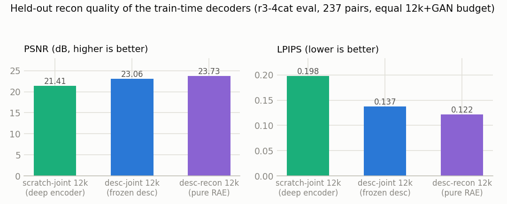
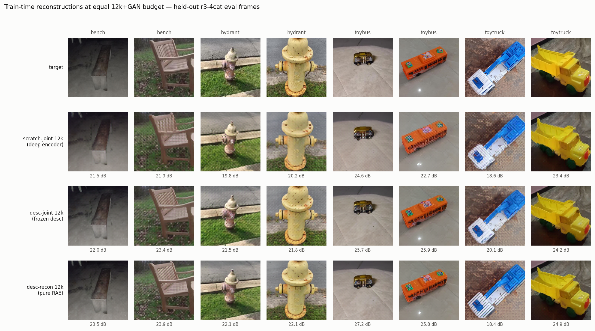

# R2 — From-scratch matcher with joint matching + reconstruction loss

Started 2026-07-14. Follows R1 (frozen-probe baseline, docs/R1.md).

**Naming**: cross-experiment tables use the canonical scheme from
docs/R3.md §Naming — this doc's v0/v1 `match`/`joint` arms are
`scratch-{match,joint} {6k,12k}` there; the frozen-DINOv3 baselines
below are `desc-{match,joint,recon}`.

## Status (2026-07-15)

- **All three v0 arms trained** (6000 steps each; results below). First
  match/joint attempts NaN'd at step ~589 — inf pixels in CO3D's fp16
  depth files reached the loss through multiply-masking (`0·inf = NaN`);
  fixed (non-finite depth marked invalid in `load_depth_320`,
  `torch.where` masking in the losses, non-finite-loss step-skip guard in
  the train loop, `n_skipped_steps` in run.json). Reruns: 0 skipped steps.
  Poisoned runs archived in `results/r2_v0/*_nanrun_bak/`.
- **Post-hoc recon probe done — headline result: joint-arm mv probes at
  18.55 dB, at the desc ceiling (18.95) and +5.3 dB over pretrained
  RoMaV2's mv; matching cost ≈ 0.** Details below.
- Feature caches cleaned up (user request): `r1_320` and `r2_probe_320`
  deleted after their runs concluded; `r2_desc_320` (20 GB) kept as the
  frozen training input.
- Warp pipeline built and validated (`r2_warp_check.py`): pointcloud
  projections land pixel-perfect; near-pair photometric check 24–31 dB
  masked PSNR. Far pairs read 12–14 dB but the warps are geometrically
  correct (viewpoint shading/exposure, verified visually). Depth-consistency
  threshold 0.01 (looser values accept back-side surfaces: scene depth ~15
  units vs ~1-unit objects).
- Vendored `dpt.py` patched: the head's unconditional bf16 autocast is now
  gated by an `enable_amp` attribute (Pascal fp32 training).

## v0 results

### Matching (final eval, 59/60 held-out pairs, `results/r2_v0/*/metrics.json`)

| arm | EPE all | PCK@1 | PCK@3 | PCK@5 | EPE near | EPE far |
|-----|---------|-------|-------|-------|----------|---------|
| `match` | 5.86 | 0.132 | 0.481 | 0.664 | 1.99 | 9.87 |
| `joint` | 6.01 | 0.141 | 0.502 | 0.657 | 1.85 | 10.32 |
| `recon` (control) | 96.2 | 0.000 | 0.000 | 0.001 | 93.0 | 99.6 |

**The reconstruction objective costs matching essentially nothing**:
joint ≈ match within noise (joint was slightly *ahead* at several
intermediate evals). Near pairs are close to saturated (PCK@5 0.97–0.98
on the near split); far pairs are the open gap (EPE ~10 px). The
recon-only control confirms the matching numbers are non-trivial
(random-init features → EPE ~96).

### Reconstruction probe (post-hoc R1 v3 protocol, mv tap)

`scripts/r2_probe_driver.sh` (run 2026-07-15): mv tokens extracted from
the frozen trained match/joint matchers for all 6691 R1 hydrant-full
probe pairs (`experiments/r2_probe_precompute.py`), then the unmodified
R1 RAE probe (fresh RAEDecoder-B per arm, `--cache-dir`/`--out-dir`
overrides added to `r1_recon_probe.py`) in
`results/r2_probe/{match,joint}/`. All rows hydrant-full, EMA decoder,
same 60 eval pairs:

| mv features from | PSNR | SSIM | LPIPS |
|------------------|------|------|-------|
| pretrained RoMaV2 (R1) | 13.29 | 0.141 | 0.631 |
| scratch-match 6k | 16.61 | 0.217 | 0.388 |
| scratch-joint 6k | **18.55** | **0.277** | **0.292** |
| `desc` ceiling (R1) | 18.95 | 0.292 | 0.282 |

Two findings:

1. **The joint arm's mv features reconstruct at essentially the desc
   ceiling** (18.55 vs 18.95 dB; LPIPS 0.292 vs 0.282) while matching is
   unchanged (table above) — with the recon gradient present from step 0
   the matcher never discards appearance. ~93 % of the pretrained
   mv→desc gap is closed. Qualitatively (recon_grid.png): joint recons
   keep object identity, paint texture, and background structure; match
   recons keep coarse shape/color under strong grid artifacts.
2. **The match-only arm sits at 16.61 dB — 3.3 dB above the pretrained
   matcher's mv.** The appearance collapse of stock RoMaV2 is therefore
   not an immediate consequence of the matching objective; it develops
   with training scale (data/steps). At v0 scale the matching loss has
   begun to erode appearance (−2 dB vs joint, −2.3 dB vs desc) but is
   far from the 13.3 dB endpoint. Implication for v1: the joint−match
   gap should *grow* with scale, and the probe pair
   (match, joint) must be rerun at every scale step to track it.

Caveats: hydrant-only domain, 6k steps ≈ 7 epochs, no refiners; the
probe decoder is capacity-uncapped per the R1 S/B/L sweep, so the
numbers measure feature content, not decoder size.

## Goal

Train the RoMaV2 **matcher from scratch on CO3D hydrants** with the
reconstruction objective present from step 0, so the matcher ViT never
learns to discard appearance. R1 established the target window:

- `desc` (frozen DINOv3 input) reconstructs at ~19–22.4 dB,
- `mv` (matcher output) collapses to ~12–13 dB,
- the collapse happens in the mv_vit second half (b3 still probes at
  17.5 dB), and it is intrinsic to the matcher stages (self-pair control),
  not fixable with more data (hydrant-full ≈ 3cat).

**R2 question:** if the matching loss and a reconstruction loss shape the
mv_vit *jointly from random init*, do the mv features stay reconstructable
— and does matching still work? The readout is the *gap between the
match-only and match+recon arms*, each measured with the frozen R1 probe
protocol, plus matching EPE on held-out hydrant pairs.

This is a **mechanism pilot**, not a benchmark run: a hydrant-only matcher
will not generalize to Mega-1500/ScanNet-1500. "Matching works" here means
hydrant-domain warp accuracy, compared across arms trained identically.

## Scaled-down design (1080 Ti constraints, user decision 2026-07-14)

- 320 px inputs (RoMaV2's own `turbo` setting is 320 px coarse-only, so
  this matches an existing inference configuration; also matches the R1
  cache resolution, keeping probe numbers comparable).
- Descriptor: DINOv3 ViT-L/16 **frozen, precomputed per frame** — since it
  never trains, backbone size only affects precompute time, not training;
  keeping DINOv3-L keeps `desc`/`mv`/`b3` directly comparable to R1.
  Per-frame cache (not per-pair like R1): the matcher needs desc for
  *both* views, and frames repeat across pairs.
- Matcher: stock architecture (`Matcher.Cfg`, mv_vit `vit_base`,
  in 2048 → width 768 → out 1024, DPT head → warp+confidence @ /4),
  random init, `enable_amp=False` (Pascal). Keeping the stock size means
  R1's stage taps (b3, mv) and the pretrained `romav2.pt` matcher remain
  like-for-like comparisons. At 320 px the mv_vit sees 2×400 tokens/pair —
  batch 8 fits 11 GB in fp32.
- **No refiners in v0.** Coarse-only training; refiners only matter for
  benchmark-grade precision and can be added in v1 if the pilot says yes.

## Supervision: dense GT warps from CO3D depth + pose

CO3D hydrant provides `frame_annotations.jgz` (PyTorch3D-convention
cameras: R, T, NDC focal/principal point + `intrinsics_format`), per-frame
16-bit depth PNGs with `scale_adjustment`, and `depth_masks`. Pipeline
(`src/co3d_geom.py`):

1. Parse annotations once → compact per-frame index (image path, size,
   camera, depth path/scale), cached to disk.
2. Convert NDC intrinsics → pixel K, then adjust K for the
   Resize(320-short-side) + CenterCrop(320) transform (same transform as
   R1's `img_to_tensor01`).
3. Convert PyTorch3D camera convention (x-left, y-up, row-vector R) to
   OpenCV convention; unproject A's depth → world → project into B.
4. GT warp in RoMaV2's normalized grid convention
   (`[-1+1/n, 1-1/n]`, (x, y) order, i.e. align_corners=False centers).
5. Covisibility mask = valid depth (depth_mask ∧ depth>0) ∧ in-bounds in B
   ∧ two-sided relative depth-consistency check against B's depth sampled
   at the warp target (loose threshold; CO3D depths are noisy MVS).

**Validation before training** (`experiments/visualizations/r2_warp_check.py`):
project `pointcloud.ply` into frames (tests K/pose without depth), then
photometric warp B→A overlays on sample pairs (tests the full warp+covis
path). No pytorch3d in the env, so the convention conversion is hand-rolled
and must pass these checks first.

## v0 losses

Matcher forward with `bidirectional=True` (both directions are nearly free:
mv_vit computes both views anyway, only the DPT head runs twice). Per
direction:

1. **Coarse match-distribution loss @ /16** (RoMa-style
   regression-by-classification): cross-entropy of `attn_AB_logits`
   (B, H_A, W_A, H_B, W_B) against the GT match position, soft-binned
   bilinearly over the 4 neighboring B-cells; averaged over covisible
   A-tokens only.
2. **DPT warp regression @ /4**: masked Charbonnier on `warp_AB` vs GT
   warp + BCE(`confidence_AB`, covisibility).
3. **Reconstruction loss** (arm-dependent): RAEDecoder-B on `f_mv_A`
   tokens (1024ch @ /16) → 320 px image A, L1 + 1.0·LPIPS(VGG). No GAN in
   the *training-time* recon loss (stability in joint training); the
   *measurement* stays the R1 v3 RAE-probe protocol, run post-hoc on the
   frozen trained matcher, so numbers remain comparable to R1.

Total: `L = L_attn + λ_warp·L_warp + λ_rec·L_rec`.

## Arms

| arm | λ_rec | question |
|-----|-------|----------|
| `match` | 0 | from-scratch baseline; does hydrant-only matching train at all, and does its mv collapse like the pretrained matcher's? |
| `joint` | > 0 | headline: does the recon gradient keep mv reconstructable, and what does it cost in EPE? |
| `recon` | matching losses off | control: matcher trained by recon alone — upper bound on mv reconstructability, lower bound on matching |

All arms: identical data, schedule, seed. Post-hoc R1 probes (mv, b3) on
each trained matcher + the pretrained `romav2.pt` numbers from R1 as the
fourth column.

## Eval

- **Matching:** EPE (px @ 320) and PCK@{1,3,5}px of the dense /4 warp on
  covisible pixels, held-out hydrant sequences (the same 6 eval seqs as
  R1's hydrant-full split, seed-shared shuffle).
- **Reconstruction:** R1 v3 probe protocol (frozen features → RAEDecoder-B,
  RAE recipe) on mv/b3 taps; PSNR/SSIM/LPIPS on the same eval pairs as R1.

## Data

`hydrant-full` split (R1): 726 extracted seqs, 6 eval / 720 train, pairs
sampled per R1's `build_pairs` (near/far alternating). Train pairs/seq can
grow beyond R1's 10 (warp GT is computed on the fly from depth; only the
per-frame desc cache costs disk, ~1.6 MB/frame fp16).
Hydrant-only pair caches from R1 were pruned 2026-07-13; the per-frame R2
desc cache (`romav2_feats/r2_desc_320/`) replaces them for training.

**Filtering pipeline** (2026-07-14, `build_train_pairs` in r2_train.py,
shared with the desc precompute; applied to *all arms* so their data is
identical; eval pairs never filtered — all 6 eval seqs pass the quality
floor anyway):
1. test-frame filter (zero depth / black RGB): 6631 → 6621 pairs
2. sequence `viewpoint_quality_score ≥ 0.5` (NaN dropped; bad SfM poses
   = systematically wrong warp GT): 6621 → 6425 pairs
3. pair covisibility floor: ≥ 8/400 covisible tokens at /16 in the better
   direction, from the `r2_pair_covis.py` census
   (`r2_meta/pair_covis_hydrant.json`) — 6425 → **4201 final train
   pairs** (−355 near / −1869 far; census medians 36 near / 6 far
   tokens). Pairs below the floor carry no matching signal and
   mis-supervise confidence ("unknown" ≠ "not covisible").
Full background: docs/co3d_depth_issues.md.

## Files

- `src/co3d_geom.py` — annotations index, camera conversion, depth
  loading, warp + covisibility computation
- `experiments/visualizations/r2_warp_check.py` — pointcloud + photometric validation
- `experiments/r2_precompute_desc.py` — per-frame desc cache
- `experiments/r2_train.py` — v0 joint training (arms above)
- `experiments/r2_probe_precompute.py` — mv extraction from trained R2
  ckpts for the post-hoc probe (+ desc fill for filtered-out frames)
- `scripts/r2_probe_driver.sh` — post-hoc probe pipeline
- `results/r2_v0/<arm>/` — ckpts, metrics.json, run.json
- `results/r2_probe/<arm>/` — post-hoc probe results (match/joint)

## Risks / open points

- CO3D MVS depth noise → loose covis threshold; if warp GT is too noisy
  the match arm won't train — the warp_check photometric PSNR gives an
  early read.
- Where to tap recon: v0 uses mv output (where collapse is worst). If
  joint training just reroutes appearance around the second half (b3-style
  split), the b3-vs-mv probe gap will show it.
- λ_rec needs one sweep point at least (e.g. 0.5 / 2.0) if the first value
  is degenerate (matching collapse or no recon effect).

## v1 — from-scratch at scale (2026-07-16, `results/r2_v1`)

Scale step over the v0 pilot, sharing the R3 data pipeline (docs/R3.md):
r3-4cat split (full hydrant/bench/toybus/toytruck, 14,236 filtered pairs,
237 eval pairs), 12,000 steps, batch 4 × grad-accum 4 = effective batch 16.
The joint arm adds a **train-time GAN** (RAE stage-1 recipe, src/rae_gan.py)
with *delayed* phase starts — disc updates from step 6000 (50%),
adversarial loss from 7500 (62.5%) — v0 had no train-time GAN at all.
Deviation from the RAE recipe: the discriminator trains on the detached
generator-pass recons (VQGAN-style) instead of fresh post-update forwards,
to avoid re-running the matcher. Ran clean: 0 NaN-skipped steps, GAN
engaged without destabilizing anything (d ≈ 0.4, adaptive λ ≈ 0.1–0.3;
`results/r2_v1/loss_curves.png`).

### Matching (final eval, 209/237 pairs, `results/r2_v1/*/metrics.json`)

| arm | EPE all/near/far | PCK5 all/near/far | coarse EPE |
|---|---|---|---|
| pretrained RoMaV2 (zero-shot reference) | 4.46 / 2.15 / 7.17 | 0.802 / 0.976 / 0.598 | 7.37 |
| match | 7.66 / 2.02 / 14.30 | 0.678 / 0.959 / 0.347 | 10.87 |
| joint (+recon+GAN) | **7.02 / 2.02 / 12.92** | **0.686 / 0.961 / 0.361** | 10.25 |

The reference row is the released `romav2.pt` matcher run zero-shot
through the same coarse-only /4-warp eval at 320 px (no refiners;
`experiments/r3_eval_cats.py --arm pretrained`). **From-scratch at v1
scale already matches it on near pairs** (EPE 2.02 vs 2.15) but loses
~2× on far pairs (12.9–14.3 vs 7.17) — wide-baseline robustness is what
web-scale pretraining bought and 14k CO3D pairs cannot; per-category
that deficit is dominated by bench (below).

- Joint is now slightly *better* than match everywhere, with the gain
  concentrated in far pairs (EPE 14.3 → 12.9) — at scale, the recon
  objective doesn't just cost nothing, it appears mildly beneficial.
- Per-category (`metrics_per_cat.json`, via `experiments/r3_eval_cats.py`):
  the far-pair weakness is almost entirely **bench** (match far-EPE 28.3,
  joint 21.3 — joint's overall far-pair edge is mostly this category);
  hydrant/toybus/toytruck sit at far-EPE 5.7–12.0. The pretrained prior
  has no such failure mode (R3 zero-shot bench far-EPE 8.7).
- Not directly comparable to v0 (hydrant-only eval); the pretrained
  fine-tunes (R3: EPE ~2.7) remain far ahead of 12k-step from-scratch
  training, as expected.
- Train-time recon with GAN: L1 0.038 / LPIPS 0.27 at the end
  (`results/r2_v1/joint/recon_grid.png`; near-photographic — see the
  side-by-side against R3's GAN-less 6k-step decoder in docs/R3.md).

### v1 reconstruction probe (2026-07-18, `results/r2_v1_probe/`)

Same R1 v3 protocol as v0 (`scripts/r23_probe_driver.sh`; hydrant-full
pairs, fresh RAEDecoder-B, EMA decoder):

| mv features from | PSNR | SSIM | LPIPS |
|---|---|---|---|
| pretrained RoMaV2 (R1) | 13.29 | 0.141 | 0.631 |
| **scratch-match 12k (v1)** | 15.99 | 0.201 | 0.453 |
| **scratch-joint 12k +GAN (v1)** | **19.06** | **0.307** | **0.245** |

**The v0 prediction held on both ends — the joint−match gap widened
from 1.9 to 3.1 dB at 2× steps / 4× data:**

1. **The match arm keeps eroding with scale** (16.61 → 15.99 dB),
   confirming that the pretrained model's 13.29 dB collapse is the
   asymptote of matching-only training, approached gradually — v1 is
   roughly a third of the way down from the v0 point.
2. **The joint arm sits at the desc ceiling** (19.06 vs 18.95 dB, and
   *better* LPIPS than the ceiling, 0.245 vs 0.282). Nominally exceeding
   the ceiling is plausible rather than paradoxical: the mv_vit's
   cross-view attention lets view A's tokens borrow appearance from
   view B, and the v1 train-time GAN shapes tokens into a
   decoder-friendly layout — but at minimum, joint training loses
   *nothing* of the input's appearance content while learning
   correspondence at full quality (matching table above).

Together with R3 (joint *fine-tuning* of the collapsed matcher restores
only ~40 % of the gap): **prevention is free, cure is hard** — the recon
objective belongs in training from step 0.

## Frozen-DINOv3 baselines at equal budget (2026-07-18, `results/r2_v1_desc`)

Controls for both v1 axes (`scripts/r2v1_desc_driver.sh` +
`--desc-baseline` in r2_train.py): the mv_vit is replaced by a linear
2048→1024 projection of the frozen desc — trainable matcher side drops
118.5M → 31.9M (2.1M linear + DPT head) — and everything else (r3-4cat
data, 12k steps, accum 4, losses, delayed-GAN recipe) matches v1
exactly. Three arms: `match`, `joint`, and `recon` — the last is a pure
RAE (recon loss only; the dead matcher head is bypassed entirely,
`skip_head` fast path).

### Matching: the deep encoder is a wide-baseline specialist

| arm | EPE all/near/far | far PCK5 | coarse EPE |
|---|---|---|---|
| desc-match | 10.34 / 2.04 / 20.12 | 0.143 | 31.2 |
| desc-joint | 10.50 / 2.10 / 20.39 | 0.141 | 31.5 |
| scratch-match 12k (mv_vit) | 7.66 / 2.02 / 14.30 | 0.347 | 10.87 |
| scratch-joint 12k (mv_vit) | 7.02 / 2.02 / 12.92 | 0.361 | 10.25 |

- **Near pairs: frozen DINOv3 + a trained DPT head fully suffice**
  (2.04–2.10 EPE ≈ the deep arms' 2.02). The trained encoder adds
  nothing there.
- **The mv_vit's entire matching contribution is wide-baseline**: far
  EPE 20 → 13–14, and coarse (attention-argmax) EPE 31 → ~11 — raw
  projected-DINOv3 cosine similarity cannot do coarse wide-baseline
  association; the cross-view attention learns it. (The baseline's
  near-pair recovery is the DPT head compensating, which stops working
  at large viewpoint gaps.)
- Recon again costs ≈ nothing (desc-joint ≈ desc-match) — no
  matching/recon interference even when the objectives share only a
  linear map.

### Reconstruction: frozen DINOv3 out-reconstructs the joint tokens on the train-time axis

Held-out recon eval of each arm's *train-time* decoder
(`experiments/r2_recon_eval.py`, all 237 eval pairs, PSNR/SSIM/LPIPS-alex;
recon grids in `results/r2_v1_desc/*/recon_grid.png`):

| decoder input (equal 12k+GAN budget) | PSNR | SSIM | LPIPS |
|---|---|---|---|
| scratch-joint 12k mv tokens (deep, non-stationary) | 21.41 | 0.531 | 0.198 |
| desc-joint (frozen desc, matching-trained proj) | 23.06 | 0.597 | 0.137 |
| **desc-recon (pure RAE on frozen desc)** | **23.73** | **0.620** | **0.122** |

(`experiments/visualizations/r2_recon_compare_fig.py` regenerates the
example grid — same eval frames decoded through all three checkpoints,
per-tile PSNR under each recon.)

- **Answer to "can an equal-budget RAE on frozen DINOv3 reconstruct as
  well?" — yes, and better: +2.3 dB over the deep joint system.** Part
  of that gap is optimization, not content: the deep arm's decoder
  chases a *moving* encoder for 12k steps while the baselines fit
  (nearly) static features. The standardized probe — fresh decoder on
  frozen final tokens — shows content parity (mv 19.06 vs desc 18.95 dB
  on the hydrant protocol), so the joint encoder retains the appearance
  *information*, but a static frozen substrate is the easier decoding
  target at train time. (Absolute numbers are not comparable across the
  two axes: different eval set, steps, and decoder state.)
- The matching gradient through the shared linear costs 0.66 dB
  (23.73 → 23.06) — measurable but tiny. **The collapse needs depth**:
  a linear map under matching pressure barely discards appearance;
  a deep encoder without a recon objective discards ~5.7 dB of it.
- The joint deep model remains the only system that does both jobs:
  the desc baselines cannot match wide-baseline (far EPE ~20), the
  match-only deep model loses appearance (15.99 dB and falling).

**Net reading of the 2×2+RAE**: appearance is cheap at every depth —
what is expensive is wide-baseline correspondence, which only the deep
encoder learns, and *it* can carry full appearance for free if (and
only if) the recon objective is present from step 0.
