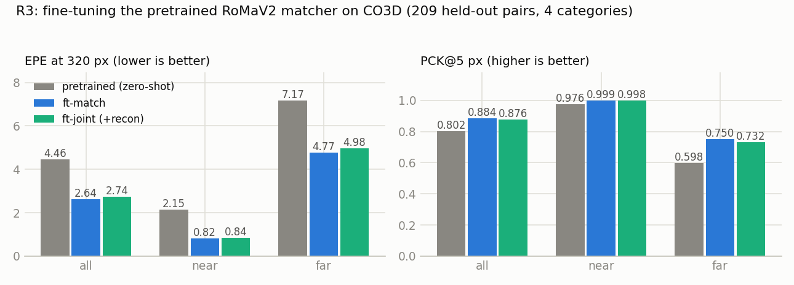
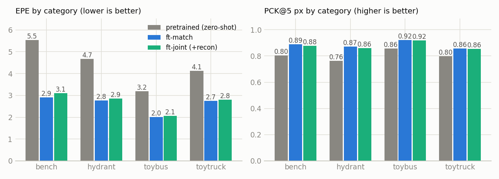
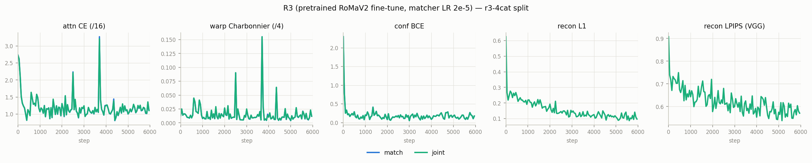
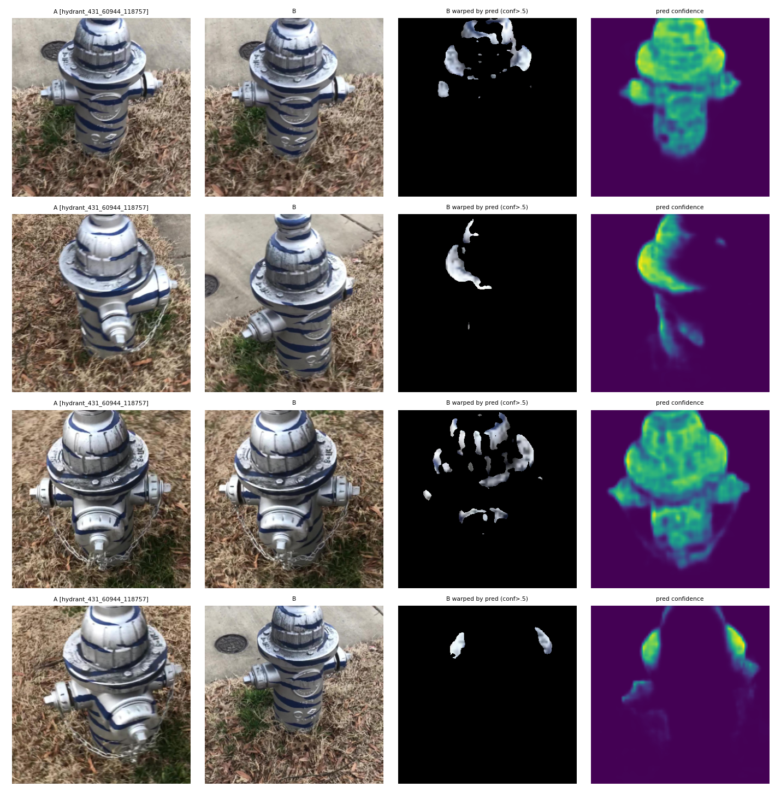
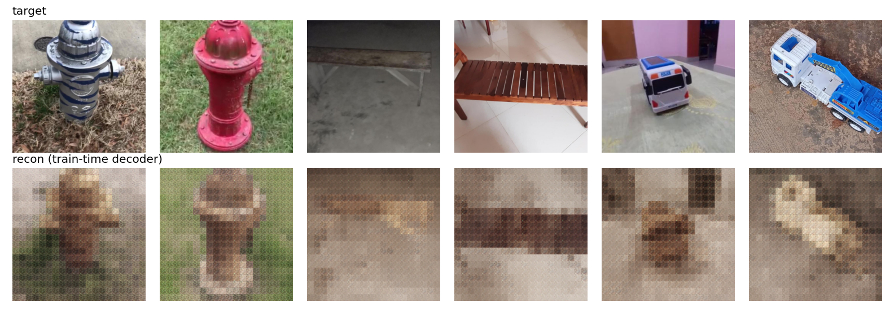
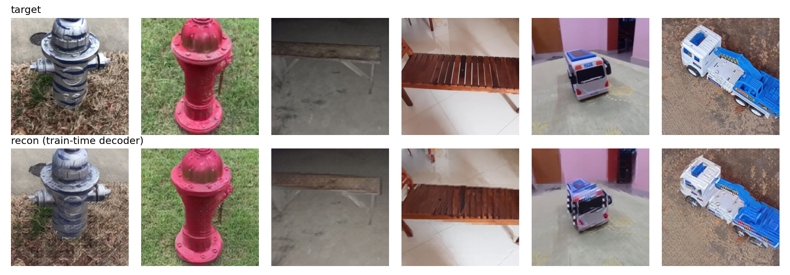
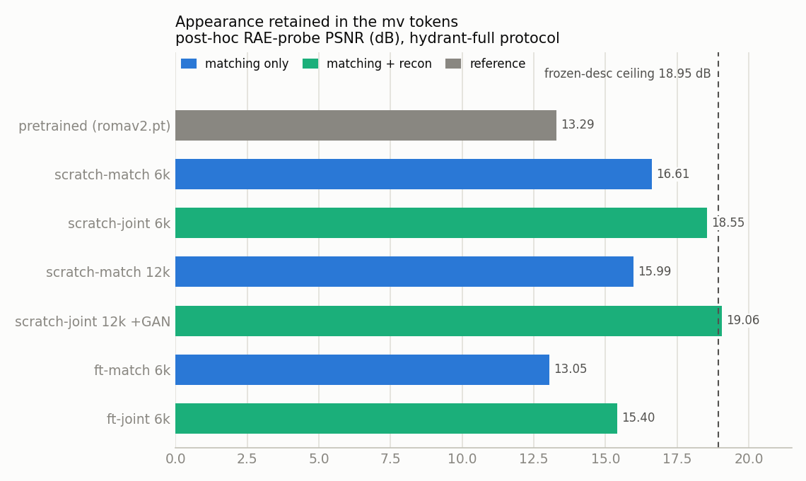
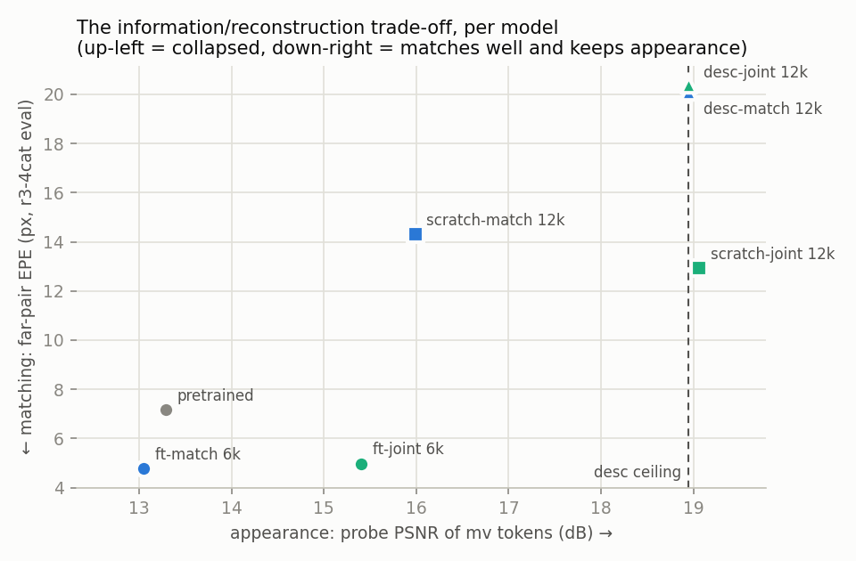
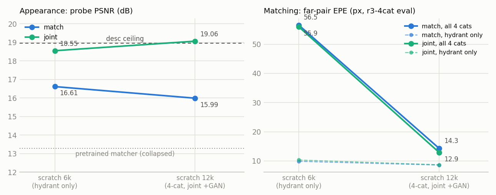

# R3: fine-tuning the pretrained RoMaV2 matcher with a reconstruction objective

## Question

R1 established that the pretrained RoMaV2 matcher has *collapsed* its mv
tokens to matching-only content: a capacity-uncapped RAE probe recovers
13.29 dB PSNR from them vs 18.95 dB from the frozen DINOv3 descriptors
the matcher consumes (docs/R1.md). R2 showed that training the matcher
*from scratch* with a joint matching+recon loss prevents that collapse at
zero matching cost — but only from random init (docs/R2.md).

R3 attacks the trade-off from the other side: start from the **pretrained,
already-collapsed** matcher (`romav2.pt`) and fine-tune with the same
joint objective. Two sub-questions:

1. Can the reconstruction objective *restore* appearance information in a
   converged matcher, and how close to the desc ceiling does it get?
2. What does carrying the recon gradient cost in matching accuracy,
   relative to a control fine-tuned on matching alone?

## Naming

Models are named `{encoder}-{objective}` plus the step budget where a
family exists at more than one:

| prefix | encoder | recipe | results |
|---|---|---|---|
| `pretrained` | stock `romav2.pt`, untouched | zero-shot eval only | `results/r3_ft/pretrained/` |
| `scratch-*` | full matcher, random init | **6k** = R2 v0 (hydrant only); **12k** = R2 v1 (4-cat, joint arm +GAN) | `results/r2_v0/`, `results/r2_v1/` |
| `ft-*` | full matcher, init from `romav2.pt` | 4-cat, 6k (this experiment) | `results/r3_ft/` |
| `desc-*` | none — frozen DINOv3 desc through a linear projection | 4-cat, 12k | `results/r2_v1_desc/` |

Objectives: `-match` = matching losses only, `-joint` = matching +
reconstruction, `-recon` = reconstruction only (a pure RAE). Post-hoc
probe results live in `results/{r2,r2_v1,r3}_probe/`; docs/R2.md's
"v0/v1 match/joint" arms are the `scratch-*` models here.

## Setup (2026-07-15; everything not listed = R2 v0, docs/R2.md)

| | |
|---|---|
| Init | matcher weights from `romav2.pt` (216 tensors, strict); RAEDecoder-B random-init |
| Data | `r3-4cat` split: full CO3D **hydrant, bench, toybus, toytruck** (hydrant listed first so its eval sequences stay identical to `hydrant-full`) |
| Train pairs | 14,236 after filtering (funnel below); 10 pairs/seq, near/far alternating |
| Eval pairs | 6 seqs × 10 pairs × 4 categories −3 key collisions = 237 sampled; **209** enter the metrics (the eval loop skips pairs with < 16 covisible /4 pixels) |
| LRs | matcher **2e-5** (10× below from-scratch), decoder 2e-4; warmup-cosine, 6000 steps, batch 4 |
| Losses | attn CE @ /16 + 5·Charbonnier warp @ /4 + BCE(conf), bidirectional; joint arm adds L1 + LPIPS recon on the mv_A tokens, `lam_rec` 1.0, no train-time GAN |
| Arms | `ft-match` (matching only — controls for "fine-tuning on CO3D by itself changes the features") and `ft-joint` (matching + recon) |
| Measurement | matching: EPE/PCK of the /4 warp on held-out pairs; appearance: post-hoc R1 RAE probe on the frozen fine-tuned matcher (hydrant-full protocol, comparable to R1/R2) |

**Data funnel** (filters run **before** desc caching; census
`r2_meta/pair_covis_r3-4cat.json`, seeded from the hydrant census):

| stage | pairs |
|---|---|
| sampled (729 hydrant / 830 bench / 265 toybus / 727 toytruck seqs) | 23,074 |
| − pairs touching test_* frames (zero depth) | 23,034 |
| − sequences with viewpoint_quality_score < 0.5 | 21,114 |
| − covis floor ≥ 8/400 tokens @ /16 (census median 17; 32.5 % of pairs below) | **14,236** |

**Pipeline**: `scripts/r3_driver.sh` (detached; waits for the co3d_full
download, extracts, census, filtered desc precompute, smoke run, then
ft-match on GPU0 + ft-joint on GPU1, ~1 h 50 min for 6k steps/arm on
1080 Ti). Training ran clean: 0 NaN-skipped steps.

## Results — matching (finished 2026-07-15 21:34)

Final eval on the 209 held-out pairs (`results/r3_ft/*/metrics.json`;
`pretrained` = the stock `romav2.pt` matcher evaluated zero-shot through
the identical coarse-only /4-warp pipeline, `experiments/r3_eval_cats.py`):

| arm | EPE all/near/far | PCK1 | PCK3 | PCK5 all/near/far | coarse EPE |
|---|---|---|---|---|---|
| pretrained (zero-shot) | 4.46 / 2.15 / 7.17 | 0.109 | 0.587 | 0.802 / 0.976 / 0.598 | 7.37 |
| ft-match | 2.64 / 0.82 / 4.77 | 0.441 | 0.773 | 0.884 / 0.999 / 0.750 | 6.88 |
| ft-joint (+recon) | 2.74 / 0.84 / 4.98 | 0.433 | 0.767 | 0.876 / 0.998 / 0.732 | 7.17 |

Three observations:

1. **The pretrained init transferred cleanly and fine-tuning pays.** Attn
   CE starts at 2.73 vs ~6.0 (= ln 400, uniform) for random init, and 6k
   steps of in-domain fine-tuning roughly halve the zero-shot EPE
   (4.46 → 2.64) and quadruple PCK1 (0.11 → 0.44). (Caveat: zero-shot
   RoMaV2 normally runs with refiners at higher resolution; this row is
   its coarse /4 warp at 320 px, i.e. exactly what the fine-tunes train.)
2. **Recon is again nearly free in a *converged* matcher**: ft-joint
   gives up only ~0.10 EPE overall and ~1.8 pt far-PCK5 against the
   ft-match control — the price of simultaneously training a full
   RAEDecoder-B on its mv tokens (train-time recon: L1 ≈ 0.11,
   LPIPS ≈ 0.57 at step 6k).
3. Both fine-tunes are far ahead of 12k-step from-scratch training on the
   same data (R2 v1: EPE 7.0–7.7, far-PCK5 0.35–0.36) — matching scale
   still dominates; see the cross-experiment table below.

### Per-category breakdown

`results/r3_ft/*/metrics_per_cat.json` (EPE all-pairs / PCK5 all-pairs):

| category | pretrained | ft-match | ft-joint |
|---|---|---|---|
| bench | 5.53 / 0.803 | 2.91 / 0.890 | 3.10 / 0.876 |
| hydrant | 4.67 / 0.762 | 2.76 / 0.873 | 2.86 / 0.864 |
| toybus | 3.19 / 0.858 | 2.01 / 0.921 | 2.07 / 0.920 |
| toytruck | 4.13 / 0.798 | 2.75 / 0.858 | 2.80 / 0.855 |

The picture is uniform: fine-tuning helps every category by a similar
factor, and the joint-vs-match gap is small and consistent (0.05–0.19
EPE) everywhere — the recon cost is not hiding in one category. Bench is
the hardest category for everyone (largest far-pair viewpoint changes);
notably it is also where from-scratch training falls apart (scratch-match 12k:
bench far-EPE 28.3 vs 4.9 here) while the pretrained prior handles it.

### Training dynamics

The match/joint curves overlap almost perfectly on all three matching
terms (`experiments/visualizations/r2_plot_losses.py`) — at matcher LR 2e-5 the recon
gradient does not visibly perturb matching optimization. The shared
spikes (~step 2.5k, 3.7k) appear in *both* arms at the same steps: the
arms consume identical data in identical order (same seed), so these are
hard batches, not instability.

### Qualitative

Warp sanity panels (`results/r3_ft/joint/warp_panels.png`, first eval
pairs — all from one held-out hydrant sequence): B warped into A by the
predicted /4 warp, masked at confidence > 0.5. The confidence maps
concentrate on the object and co-visible ground, and collapse to small
high-precision islands on wide-baseline pairs (rows 2/4) — consistent
with the BCE-against-covisibility training signal, since CO3D's strict
depth masks make "covisible" an object-centric label.

## Results — reconstruction

### Train-time decoder (lower bound, not the measurement)

The ft-joint decoder's recons at 6k steps keep coarse layout, object
placement and background gist but are washed out and blocky (L1 0.11 /
LPIPS 0.57). Two reasons this *understates* the appearance content of
the tokens: the decoder is only 6k steps old (the R1 probe protocol
trains its decoder to convergence with a GAN phase), and there is no
adversarial term. For calibration, the same decoder architecture inside
the scratch-joint 12k run — 12k steps *with* the delayed GAN — reaches
near-photographic recons on the same eval frames:

So decoder-side training scale/objective, not token content, dominates
the visual quality of train-time recons. Conclusions about what the
*tokens* contain come from the standardized probe below.

### Post-hoc RAE probe (the actual measurement)

How to read probe numbers: the probe trains a *fresh* decoder on the
**frozen** tokens of a finished matcher — the matcher is never updated,
so the probe cannot change (or degrade) the model. It measures the
appearance *information* left in the tokens under an identical decoder
budget for every arm; it is not the deployed recon quality of the
train-time decoder above, and the two are not comparable in absolute
terms (different eval pairs and decoder budgets).

The R1 v3 probe protocol (fresh RAEDecoder-B per arm on frozen mv
tokens, hydrant-full pairs, EMA decoder — directly comparable to R1/R2;
`scripts/r23_probe_driver.sh`, results 2026-07-18 in
`results/r3_probe/`, `results/r2_v1_probe/`):

| mv features from | PSNR | SSIM | LPIPS |
|---|---|---|---|
| pretrained (R1) | 13.29 | 0.141 | 0.631 |
| **ft-match** | 13.05 | 0.141 | 0.613 |
| **ft-joint** | **15.40** | 0.196 | 0.502 |
| scratch-match 6k (R2 v0) | 16.61 | 0.217 | 0.388 |
| scratch-joint 6k (R2 v0) | 18.55 | 0.277 | 0.292 |
| scratch-match 12k (R2 v1) | 15.99 | 0.201 | 0.453 |
| scratch-joint 12k +GAN (R2 v1) | **19.06** | **0.307** | **0.245** |
| desc ceiling (R1) | 18.95 | 0.292 | 0.282 |

**The R3 answer: restoration is real but partial — prevention ≫ cure.**

1. **Matching-only fine-tuning leaves the collapse fully intact**:
   ft-match probes at 13.05 dB ≈ the pretrained 13.29. Six thousand
   in-domain matching steps neither restore nor (measurably) further
   destroy appearance — the collapsed representation is a stable point
   of the matching objective.
2. **The recon objective claws back +2.35 dB over the ft-match control**
   (15.40 vs 13.05) — but that is only ~40 % of the gap to the desc
   ceiling, vs ~93 % for from-scratch joint training (R2 v0, same 6k
   steps, same λ_rec). Starting from a converged matcher, the recon
   gradient must actively undo a learned invariance at a matcher LR
   (2e-5) chosen to protect matching — and at that budget it only
   partially succeeds.
3. Open lever: matcher LR / step budget. Whether longer or hotter
   joint fine-tuning closes the rest of the gap (and at what matching
   cost) is the natural R3 follow-up before concluding the asymmetry is
   fundamental.

Note also the budget asymmetry across the scratch rows: scratch-joint at
**6k** steps (18.55 dB) already beats scratch-match at **12k** (15.99) —
the joint objective retains more appearance with half the training
budget than matching-only keeps with double.

The v1 rows (analyzed in docs/R2.md) frame the asymmetry from the other
side: at 2× steps / 4× data the from-scratch match arm keeps eroding
(16.61 → 15.99 dB, heading toward the pretrained 13.29 endpoint) while
the joint arm sits *at* the ceiling (19.06). That it lands nominally
*above* the 18.95 desc ceiling is within probe noise — and not
impossible either: the mv_vit's cross-view attention lets view A borrow
appearance from view B, and the v1 train-time GAN shapes the tokens
decoder-friendly. The joint−match gap grew from 1.9 dB (v0) to 3.1 dB,
as the R2 thesis predicted.

## Cross-experiment view (r3-4cat eval, 209 pairs)

| model | steps | near EPE | far EPE | far PCK5 | probe PSNR (hydrant protocol) |
|---|---|---|---|---|---|
| pretrained (zero-shot) | — | 2.15 | 7.17 | 0.598 | 13.29 |
| desc-match | 12k | 2.04 | 20.12 | 0.143 | 18.95 (≈ desc, by construction) |
| desc-joint | 12k | 2.10 | 20.39 | 0.141 | 18.95 (≈ desc, by construction) |
| scratch-match (hydrant-only data) | 6k | 3.95 | 56.48 | 0.113 | 16.61 |
| scratch-joint (hydrant-only data) | 6k | 3.64 | 55.90 | 0.107 | 18.55 |
| scratch-match | 12k | 2.02 | 14.30 | 0.347 | 15.99 |
| scratch-joint (+GAN) | 12k | 2.02 | 12.92 | 0.361 | **19.06** |
| ft-match | 6k | 0.82 | 4.77 | 0.750 | 13.05 |
| ft-joint | 6k | 0.84 | 4.98 | 0.732 | 15.40 |

Reading down the columns: from-scratch at v1 scale already reaches the
released model's *near-pair* accuracy on this domain but loses ~2× on
far pairs (the bench category alone accounts for most of it); in-domain
fine-tuning beats the zero-shot reference everywhere. The frozen-desc
baselines (docs/R2.md "Frozen-DINOv3 baselines") bracket the picture:
near-pair matching needs no trained encoder at all, wide-baseline
matching is what the deep encoder buys (far EPE 20 → 13), and appearance
is trivially retained when nothing deep trains. (The scratch 6k rows are
the v0 checkpoints evaluated post-hoc on this split — they trained on
hydrant only, so their far-pair numbers are dominated by the three
unseen categories; the scaling section below decomposes this.)

The scatter is the whole project in one plot: the joint arms sit at the
same matching accuracy as their match-only twins but far to the right in
appearance; scratch-joint 12k touches the desc ceiling, while the
pretrained matcher and ft-match sit at the collapsed left edge, and ft-joint
lands in between — restoration is partial, prevention is complete. The
frozen-desc baselines occupy the remaining corner (top-right): full
appearance because nothing deep trains, but no wide-baseline matching.

## Scaling the from-scratch recipe (scratch 6k → 12k)

Caveat first: this is **recipe scaling, not a controlled steps sweep** —
from 6k to 12k the steps double, the data widens from hydrant-only to 4
categories (~4× pairs), and the joint arm gains the delayed GAN. The
claim is "scaling the whole recipe", with the axes entangled. To make
the matching side comparable, the 6k (v0) checkpoints were evaluated
post-hoc on the same 209-pair r3-4cat eval as everything else
(`r3_eval_cats.py --run r2_v0`); the probe column was always comparable
(same hydrant protocol for all arms).

| model | far EPE all / hydrant-only | probe PSNR |
|---|---|---|
| scratch-match 6k | 56.5 / 9.9 | 16.61 |
| scratch-joint 6k | 55.9 / 10.3 | 18.55 |
| scratch-match 12k | 14.3 / 8.6 | 15.99 |
| scratch-joint 12k +GAN | 12.9 / 8.7 | 19.06 |

Two opposite trends, and they are the report's argument in miniature:

1. **Matching improves with scale — for both arms equally.** The bulk of
   the far-EPE drop (56 → 13–14) is category coverage: the 6k models
   collapse on the three categories they never saw (bench far EPE ~96–99)
   while staying reasonable on hydrant. But the in-domain dashed lines
   improve too (hydrant far EPE ~10 → ~8.6), so scale helps matching
   everywhere, not just on new categories.
2. **Appearance diverges with scale.** The same scaling that improves
   matching *erodes* appearance in the match arm (16.61 → 15.99 dB,
   heading for the pretrained 13.29 endpoint) and *improves* it in the
   joint arm (18.55 → 19.06, at the desc ceiling). Scaling the joint
   recipe makes the model better on both axes at once; scaling the
   matching-only recipe converts the extra budget into appearance
   destruction. Note the budget asymmetry: scratch-joint at 6k already
   retains more appearance than scratch-match keeps at 12k.

If the trend holds at the next scale step, the gap keeps widening — the
recon objective is not a tax that scale amortizes away, it is the only
thing standing between the encoder and the collapse endpoint.

## Reproduction

- `scripts/r3_driver.sh` — download-wait → extract → census → filtered
  desc precompute → smoke → ft-match + ft-joint (`results/r3_ft/`)
- `experiments/r3_eval_cats.py` — per-category eval of any checkpoint,
  plus the pretrained zero-shot baseline (`metrics_per_cat.json`; also
  used to put the scratch 6k ckpts on this eval: `--run r2_v0`)
- `scripts/r23_probe_driver.sh` — post-hoc probes for the R3 and R2 v1
  checkpoints (`results/r3_probe/`, `results/r2_v1_probe/`)
- `experiments/visualizations/r3_report_figs.py` — regenerates `docs/figures/r3/fig_*.png`
  from the metrics JSONs (rerun as results land)

## Caveats / open

- 4 CO3D categories, object-centric video; no claim about benchmark
  generalization (Mega-1500 etc.), and the coarse-only 320 px pipeline
  has no refiners.
- The eval discards pairs with < 16 covisible /4 pixels (209/237); the
  dropped pairs are the extreme wide-baseline tail, so far-pair numbers
  are optimistic relative to "all sampled pairs".
- Matcher LR 2e-5 was not swept; a higher LR might trade more matching
  drift for faster appearance restoration in ft-joint.
- λ_rec fixed at 1.0 as in R2; no sweep.
